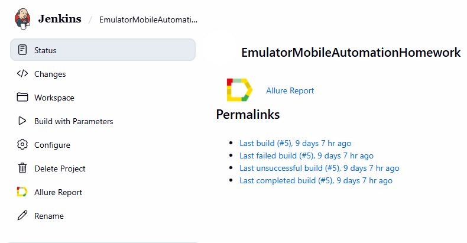
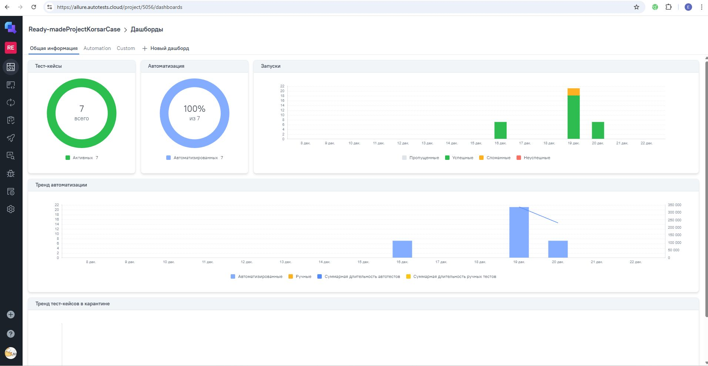
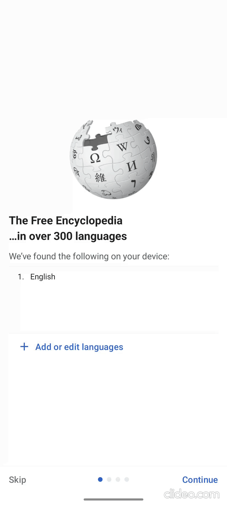

# Проект по автоматизации тестирования для мобильного приложения [Wikipedia](https://ru.wikipedia.org)
<a href="https://github.com/wikimedia/apps-android-wikipedia/releases/tag/latest"></a>

## Структура

* <a href="#tools">Стек</a>
* <a href="#cases">Реализованные проверки</a>
* <a href="#console">Запуск из терминала</a>
* <a href="#jenkins">Сборка в Jenkins</a>
* <a href="#allure_TestOps">Интеграция с Allure TestOps</a>
* <a href="#video">Видео примера запуска теста</a>
---

<a id="tools"></a>
## Стек

<p align="center">  
<a href="https://www.java.com/"></a> 
<a href="https://junit.org/junit5/"></a> 
<a href="https://www.browserstack.com/"></a> 
<a href="https://appium.io/"></a>
<a href="https://selenide.org/"></a>
<a href="https://qameta.io/"></a>
<a href="https://allurereport.org/"></a>
<a href="https://gradle.org/"></a> 
<a href="https://www.jenkins.io/"></a>
<a href="https://github.com/"></a> 
<a href="https://www.jetbrains.com/idea/"></a> 
</p>

---
<a id="cases"></a>
## Реализованные проверки
- Проверка всех экранов онбординга
---
<a id="console"></a>
##  Запуск из терминала

Локальный запуск на эмуляторе:
```
./gradlew clean emulatorOrReal -DdeviceHost=emulation
```
Локальный запуск на реальном устройстве:
```
./gradlew clean emulatorOrReal -DdeviceHost=real
```
Запуск на Browserstack:
```
./gradlew clean browserstack -DuserName=${userName} -DaccessKey=${accessKey}
```
где параметры ```userName``` и ```accessKey``` это креды для аккаунта Browserstack.

---
<a id="jenkins"></a>
##  Сборка в Jenkins

[Сборка в Jenkins](https://jenkins.autotests.cloud/job/EmulatorMobileAutomationHomework/)



---
<a id="allure_TestOps"></a>
##  Интеграция с Allure TestOps
[Ссылка на Allure TestOps](https://allure.autotests.cloud/project/5056/test-cases?treeId=0)

* ### Главный экран запуска


* ### Dashboard прогонов


---
<a id="video"></a>
##  Пример видео выполнения теста на эмуляторе андроид

<p align="center">    

</p>